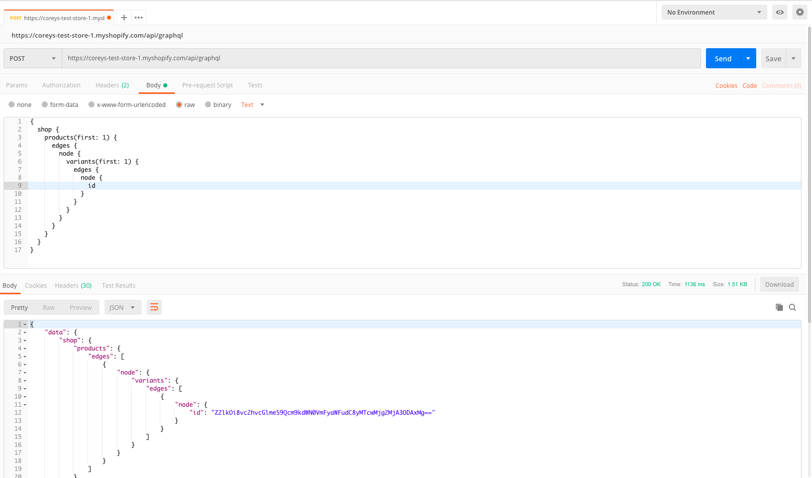

# GraphQL on Shopify

## Basics

- GraphQL is a query language for APIs which provides a more efficient, powerful and flexible alternative to REST

- It is not a query language for databases, so you can build a GraphQL layer on top of your existing API

- At it's core, GraphQL enables declarative data fetching. This is where a client can specify exactly what data it needs from an API. 

- Instead of having multiple endpoints which return fixed data structures, GraphQL only exposes a single endpoint:

```graphql
POST /api/graphql
```
___

## Problems with REST

GraphQL addresses the following problems encountered when working with a REST API:

- Fetching associated data often requires multiple HTTP calls
- Apps receive way more data than they actually need
- We don’t know what data an app actually needs

## GraphQL Solution

- #### Everything is typed and everything you want to expose is part of a schema

In order to make something accessible via your GraphQL API, it needs to be part of the schema. Clients craft queries and get back only what they requested. Not only does this solve the over-fetching data problem, it also means as an API provider, we know exactly what each app is using.

- #### Documentation is a first-class citizen

This means the documentation for your API will live side-by-side with the code that constitutes it. Combined with the typed schema, it means we can auto-generate accurate and up-to-date documentation whenever something changes.

- #### Deprecation is a first-class citizen

We can easily mark a part of our schema as deprecated and this will also be reflected in documentation. 
___

## Example

Tutorial and download instructions: 

https://help.shopify.com/en/api/custom-storefronts/storefront-api/getting-started#retrieving-ids

- A GraphQL query is a string interpreted by a server that returns data in a specified format

#### Here is an example query:

Endpoint: https://coreys-test-store-1.myshopify.com/api/graphql

Method: POST

```graphql
{
  shop { <!-- root field -->
    name <!-- payload -->
    primaryDomain {
      url
      host
    }
  }
}
```

And here is the response to that query:

```graphql
{
  "data": {
    "shop": {
      "name": "graphql",
      "primaryDomain": {
        "url": "https://graphql.myshopify.com",
        "host": "graphql.myshopify.com"
      }
    }
  }
}
```

## Connections

The most popular method for pagination in GraphQL are GraphQL connections. 

#### The data from a custom storefront can be represented like a graph:


The circles in the graph are called “nodes” and the lines of the graph are called “edges.” An edge is a line that connects two nodes together, representing some kind of relationship between the two nodes. We can think of nodes as being resources.


___

## Mutations

- Create new data
- Update existing data
- Delete existing data

Mutations follow the same syntactical structure as queries, but they always need to start with the mutation keyword

### Example:

We're going to create a new checkout for one item using a GraphQL Mutation

#### First, query the storefront API for the data you need:

*In this case we just need the product ID*



#### Next, create the mutation:

*Similarly to queries, in a mutation you can also specify payloads. So in this example we are requesting the ID and URL properties of the checkout object, and the title and quantity properties of the first line item.*


#### Now we can search that web URL in the browser and see the result:


___

Resources: 

https://www.youtube.com/watch?v=S4hTq_3yQrk

https://www.howtographql.com/

https://blog.apollographql.com/explaining-graphql-connections-c48b7c3d6976


