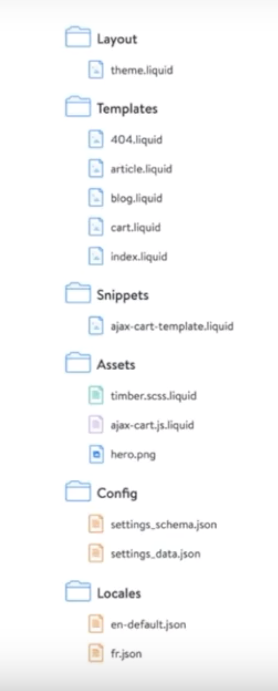

# Design and Theming Fundamentals

Notes on working with Shopify’s front-end development tools and frameworks. Learn the basic of installing, customizing, and developing themes as you familiarize yourself with Liquid, theming APIs, and the Slate framework.

## Basics

Fundamentally, a Shopify theme is a way to ‘skin’ an online store, creating a beautiful look-and-feel. A Shopify theme is a collection of files that work together to control the look and presentation of the content from an online store. A theme modifies the way the site is displayed, without modifying the underlying software provided by Shopify.

### Themes are used to:
- Change the HTML markup of a Shopify online store and what information is displayed
- Add CSS styles to change the layout, color, or typography on one or more pages
- Use JavaScript to enhance the user experience and create impactful interactions

## Standards

- Well-structured, semantic, error-free, and valid HTML and Liquid
- Clean, valid CSS or Sass (depending on your preference)
- Legible, performant, clean JavaScript

## Design thinking

The Design Thinking methodology is a five stage approach:

- Research
- Define
- Ideate
- Prototype
- Test

## Checkout.liquid

Using a checkout.liquid template file, merchants on a Shopify Plus account have the option to further customize their checkout experience. 

## Shopify Scripts

Provide a way to create custom scripts that are run each time a customer adds an item to their online cart. Scripts has uses that can include anything from discounting products with specific tags, to running "buy 2, get 1 free" promotions.

## Theme development approaches

1. Customize a theme using only the Shopify theme editor
2. Take an existing theme and modify its codebase
3. Create a custom theme from scratch

## Theme Structure

Shopify themes have a specific directory structure. There are no subdirectories inside the top-level directories, and any additional directories included in a theme are stripped out upon upload to Shopify. Because of this, namespacing files is recommended, especially within the assets folder, as it helps with findability.

Shopify themes contain the following directories.  

- #### Assets
Assets contain all the assets used in the theme, including images, stylesheets, and JavaScript files. 

`theme.liquid` - Global file for the entire site. Changes here will effect every page.

- #### Config
Config contains two JSON files to control the theme editor aka. the Customize Theme section of a Shopify store, allowing a developer to easily create theme options.

- #### Layout
Layouts contains theme.liquid layout template; this template is usually the largest wrapper, and includes your header and footer.

- #### Locales
Locales are used to provide translated content for the theme.

- #### Sections
Sections are reusable modules of content that can be customized, dragged/dropped, and re-ordered by users of the theme.

There are two types of sections:
1. Static - Added to a specific location of the page and don't move around. Can be added to any page of the theme. 

2. Dynamic - Moveable sections which can be adjusted by the admin. Can only be added to the home page.

- #### Section Blocks
Blocks are containers of settings and content which can be added, removed or reordered within a section itself. You can think of a block as being a section within a section.

- #### Snippets
Snippets are bits of code that can be referenced in other Liquid template files within a theme. Use the Liquid include tag to load a snippet into your theme.

- #### Templates
Templates contains all other Liquid templates, including those for customer accounts. Templates usually include snippets, and templates render in the {{ content_for_layout }} tag, found in the theme.liquid file.

## Shopify Theme Kit

A cross-platform tool for building Shopify Themes which aids local development.

Features:

- Uploading themes to multiple environments
- Transfering theme files and themes quickly to Shopify stores
- Watching for local changes and uploading automatically to Shopify

## Slate

Slate is a theme scaffold and command line tool for building Shopify themes. Slate is both a theme scaffold and a set of command line tools, which help you build custom themes for Shopify. Slate helps make the development process faster for theme developers.

Slate uses Theme Kit as part of its npm package `slate-tools` to sync local theme files to Shopify’s servers.

Features:

- Intentionally blank — Slate only includes standard Liquid tags and logic that will likely be used in each template. 
- Templates and configuration — Includes all the required files, layouts, and Liquid templates for a functioning online store.
- Sass helpers — Includes Sass scaffolding and helpers, such as a normalize.css as well as some additional helper styles.
- JavaScript helpers — Help handle Shopify-specific considerations.

## Sass

Shopify currently supports version 3.2

Best practices:

- Two (2) spaces indents, not single tabs.
- Line length of 80-characters or less.
- Meaningful use of whitespace

Guidelines:

- Avoid nesting more than three levels deep
- Make sure the CSS output is clean and reusable
- Use nesting when it makes sense, not as a default option
- Ensure all colors have variable names
- Use contextual media queries and store them as variables
- Keep your Sass modularized and organized

## Shopify Apps

- #### Public Apps
Interact with the Shopify API on behalf of multiple stores
- #### Private Apps
Interact with the Shopify API on behalf of only one particular store

It's best to only build a private app when the client needs some kind of custom functionality that can’t easily be accomplished using Liquid and existing fields in the Shopify Admin.

## AJAX API

Shopify provides shop-owners with an Ajax API that returns JSON-encoded responses.

The Ajax API makes it possible to add items to the cart, update quantities in the cart, and fetch information about the cart—all without a page refresh.

## Storefront API

In contrast with the Admin API, which enables developers to build apps around merchant-facing actions (such as shipping and fulfillment), the Storefront API focuses on shopping experiences seen from the customer perspective.

Using the Storefront API, you can:

- Fetch data about a single product or a collection of products to display on any website or device
- Create unique checkout experiences with full control over the shopping cart
- Create new customers or modify existing ones, including address information
- Allow customers to select unique product options

## Shopify Polaris

Shopify Polaris is a design system that is meant to help designers and developers provide a well designed and consistent experience for merchants. 

Shopify Polaris can be broken down into five main parts:

- #### Product guides
What is the purpose and mission behind Shopify and crafting the Shopify Admin?

- #### Product content
How to think strategically about the language in your apps, shops, and themes, and what does that look and feel like?

- #### Visual properties
What is the “skin” of the product? How is that represented, and why?

- #### Components
What are the UI components needed to consistently build products across devices?

- #### Product patterns
What is the best way to understand the layout, structure and content of a screen?

## Polaris Components

Components are a collection of interface elements that can be reused across the Shopify system. There are two options for installing and implementing Shopify Polaris components: using React components or CSS components.

